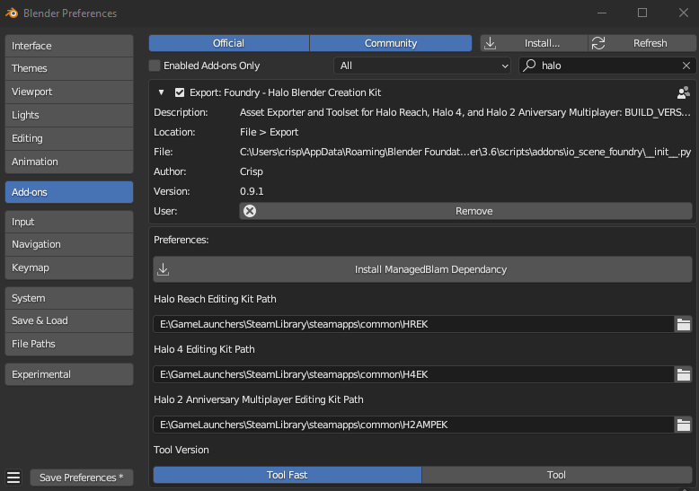
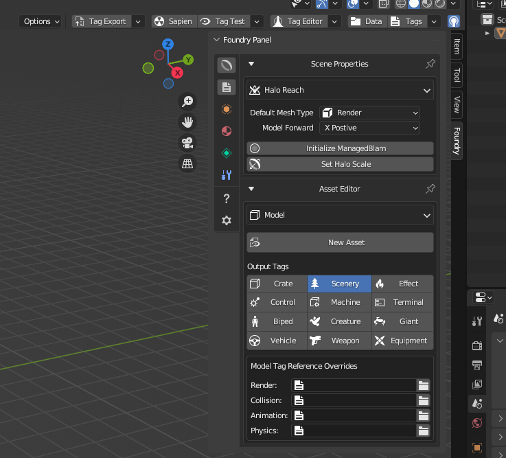

  

# [Download](https://github.com/ILoveAGoodCrisp/Foundry-Halo-Blender-Creation-Kit/releases/download/0.9.2/foundry-v0.9.2@07e2e7f.zip)

**Foundry** is a Blender addon that facilitates a complete 3D asset import pipeline for the Halo Reach, Halo 4, and Halo 2 Anniversary Multiplayer Editing Kits.
By integrating with the Halo Editing Kits, Foundry allows you to easily transform your Blender creations into game-ready Halo assets.

Foundry can:
- Export Blender scenes and build tags in a single click. No intermediary steps required
- Create Halo Models, Animations, Scenarios, Skies, Decorators, Particle Models, & Prefabs
- Lightmap Halo Scenarios and Models
- Integrate with the Halo tag editing API "ManagedBlam" to allow tag editing and creation directly from Blender

## Requirements
- Blender 3.6.1 or above
- One or more of the following Halo Editing Kits: [HREK](https://store.steampowered.com/app/1695790/Halo_2_Anniversary_MP_Mod_Tools__MCC/),
[H4EK](https://store.steampowered.com/app/1695792/Halo_4_Mod_Tools__MCC/),
[H2AMPEK](https://store.steampowered.com/app/1695790/Halo_2_Anniversary_MP_Mod_Tools__MCC/)

To install the afformentioned editing kits, you must own the respective MCC title on Steam. Links to these titles are shown [below](#supported-titles).

## Supported Titles
| Games | Version | Editing Kit | Platform |
| --- | --- | --- | --- |
| [Halo Reach](https://store.steampowered.com/app/1064220/Halo_Reach/) | MCC | [HREK](https://store.steampowered.com/app/1695790/Halo_2_Anniversary_MP_Mod_Tools__MCC/) | PC |
| [Halo 4](https://store.steampowered.com/app/1064273/Halo_4/) | MCC | [H4EK](https://store.steampowered.com/app/1695792/Halo_4_Mod_Tools__MCC/) | PC |
| [Halo 2: Anniversary (Multiplayer)](https://store.steampowered.com/app/1064270/Halo_2_Anniversary/) | MCC | [H2AMPEK](https://store.steampowered.com/app/1695790/Halo_2_Anniversary_MP_Mod_Tools__MCC/) | PC |

## Installation
- Go to the [releases page](https://github.com/ILoveAGoodCrisp/Foundry-Halo-Blender-Creation-Kit/releases) and download the latest release's zip file

- Open Blender and navigate to Edit > Preferences. Switch to the Add-ons tab and click Install in the top right. Select the Foundry Addon zip file using the file browser dialog

- Activate the addon and follow the [guide](#quick-start-guide) below to get started with using Foundry

## Quick Start Guide
- Open Foundry Preferences and input the paths to your Editing Kits. You can either paste the paths or use the folder icon to open a folder browser dialog

- If you see a asterisk next to *Save Preferences*, click this button before proceeding
- Click *Install ManagedBlam Dependancy* to install the the python module necessary to allow Foundry to communicate with the Halo tag API.
- Restart Blender
- Navigate to the right hand side of the 3D View. If you cannot see the Foundry Panel, click the small arrow facing away from the outliner or press *N*. Now select *Foundry* from the Tools Panels

- To create your first Halo asset click the *New Asset* button inside of the Asset Editor sub-panel. This will prompt a file dialog to specify a location and type for your new asset. Once your Blender scene is ready to export, use the *Tag Export* option in the Foundry Toolbar to export your asset to your preferred Halo Editing Kit

## Credits
- [Crisp](https://github.com/ILoveAGoodCrisp) - Addon Developer
- [Alexis Jonsson | WyvernZu](https://github.com/AlexisJonsson) - UI/UX/Icon Design
- [General Heed](https://github.com/Generalkidd) - Scale models

## Special Thanks
Testing and reporting bugs:
- [SpacedZed](https://github.com/SpacedZed)
- [Ryan | Stryking](https://github.com/stryking)
- [Pepperman](https://github.com/Pepper-Man)
- [ChunkierBean](https://github.com/TheChunkierBean)
- [Enash](https://github.com/EnashMods)
- [lolhalolol1](https://github.com/lolhalolol1)
- [ivanovitch](https://github.com/ivanivanovitch)
- [Greenknight](https://github.com/GreenKnight5417)
- [Gashnor](https://github.com/Gashnor)
