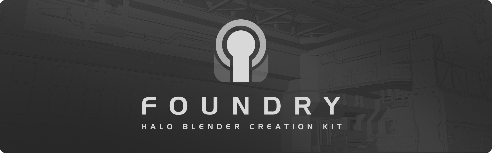
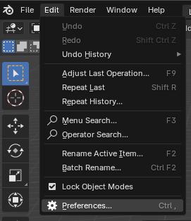
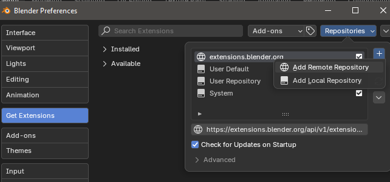
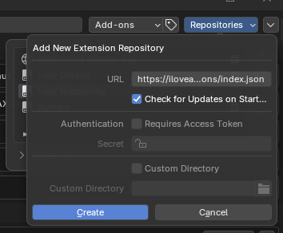
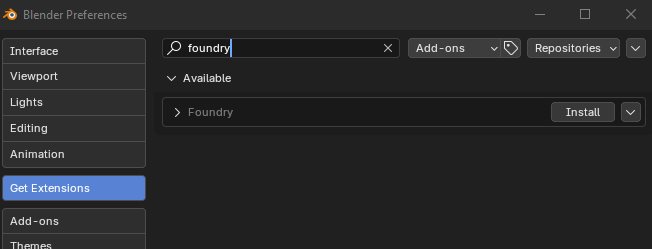
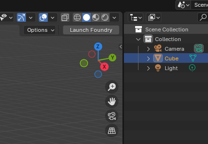

  

**Foundry** is a Blender extension that facilitates a complete asset import & export pipeline for Halo Reach, Halo 4, and Halo 2 Anniversary Multiplayer.

## Requirements
- Blender 4.3 or above
- One or more of the following Halo Editing Kits: [HREK](https://store.steampowered.com/app/1695790/Halo_2_Anniversary_MP_Mod_Tools__MCC/),
[H4EK](https://store.steampowered.com/app/1695792/Halo_4_Mod_Tools__MCC/),
[H2AMPEK](https://store.steampowered.com/app/1695790/Halo_2_Anniversary_MP_Mod_Tools__MCC/)

To install the afformentioned editing kits, you must own the respective MCC title on Steam.

> [!CAUTION]
> Remove any previous installations of Foundry before following the installation guide. The legacy addon version may conflict with the extension.

## Installation

Foundry only needs to be installed once. Thereafter, you can use Blender to download any future updates automatically. If you would prefer to install a local standalone version of Foundry, skip to the Standalone Installation instructions below this section.

- Launch Blender and open Preferences 
  

- Navigate to the **Get Extensions** tab and then click **Repositories**
- On the **Repositories** windows click the `+` icon and then **Add Remote Repository** 
  

- In the **Add New Extension Repository** window copy and paste the following text into the **URL** field: `https://iloveagoodcrisp.github.io/Foundry/api/v1/extensions/index.json`
- I recommend checking the **Check for Updates on Startup** box, but this is optional
-  Now click **Create** to link the remote repository to Blender 
  

- Enter `Foundry` into the search box and you should see the **Foundry** addon show up with an option to install 
  

- Once installed, you should have a **Launch Foundry** button show in the top right of the 3D viewport. Click this button to load the addon 
  

## Standalone Installation

- The standalone zip can be downloaded [here](https://iloveagoodcrisp.github.io/Foundry/api/v1/extensions/io_scene_foundry.zip)

- Locate the file you downloaded named `io_scene_foundry.zip` and then open Blender. Drag and drop the zip file into Blender and press **Ok** on the dialog box that appears

## Credits
- [Crisp](https://github.com/ILoveAGoodCrisp) - Addon Developer
- [Alexis Jonsson | WyvernZu](https://github.com/AlexisJonsson) - UI/UX/Icon Design
- [General Heed](https://github.com/Generalkidd) - Early Foundry work
- [Krevil](https://github.com/Krevil) - Guidance on editing GR2 files and for research into Cubemap checksum calculation
- [Gravemind2401](https://github.com/Gravemind2401) - Advice on tag extraction
- [Matthew](https://github.com/matty45) - GR2 Research
- [Chiefster](https://github.com/chiefster-4014) - Creation of Blender Material Nodes for Halo models
- Soul - Creation of Blender Material Nodes for Halo models

## Special Thanks
Testing and reporting bugs:
- [SpacedZed](https://github.com/SpacedZed)
- [Ryan | Stryking](https://github.com/stryking)
- [Pepperman](https://github.com/Pepper-Man)
- [ChunkierBean](https://github.com/TheChunkierBean)
- [Enash](https://github.com/EnashMods)
- [lolhalolol1](https://github.com/lolhalolol1)
- [ivanovitch](https://github.com/ivanivanovitch)
- [Greenknight](https://github.com/GreenKnight5417)
- [Gashnor](https://github.com/Gashnor)
